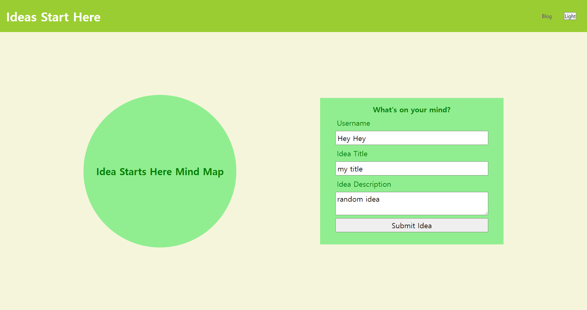
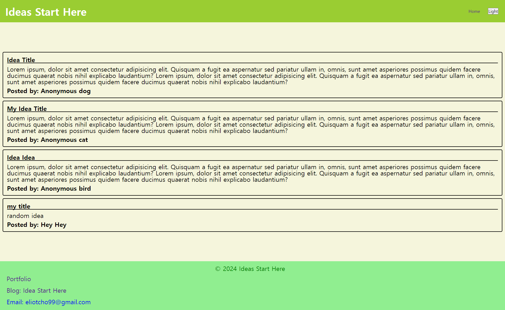
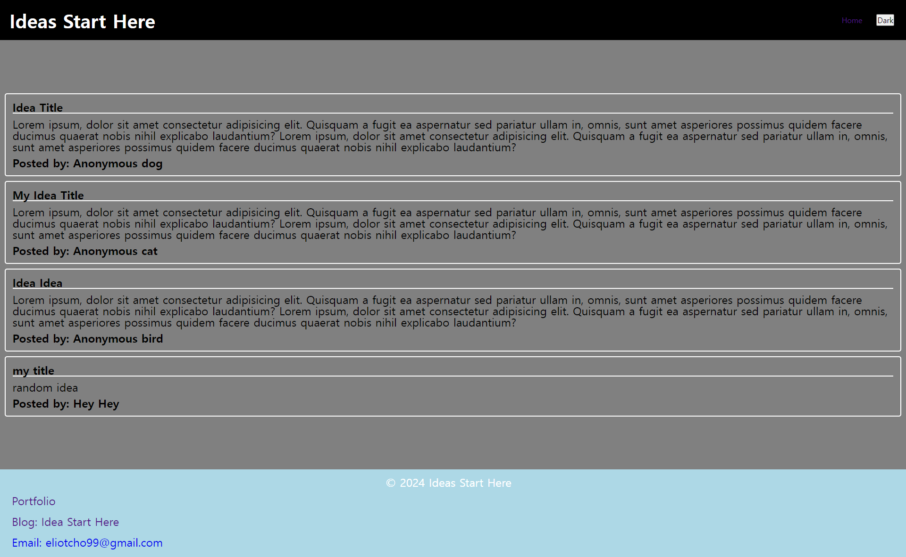
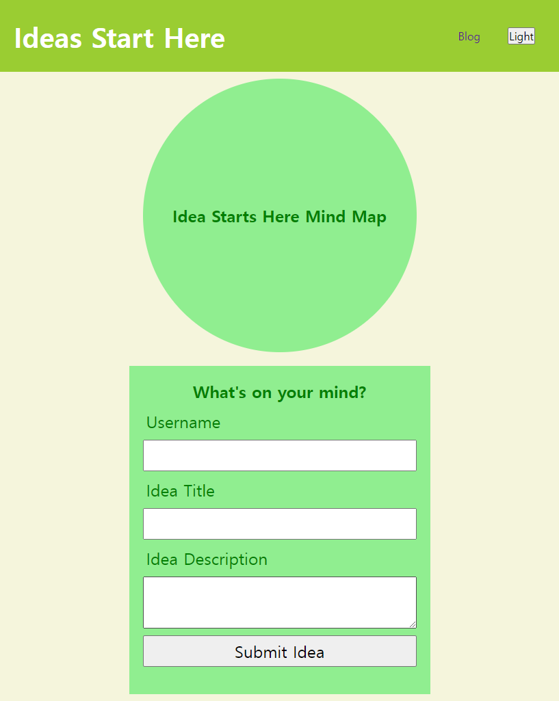
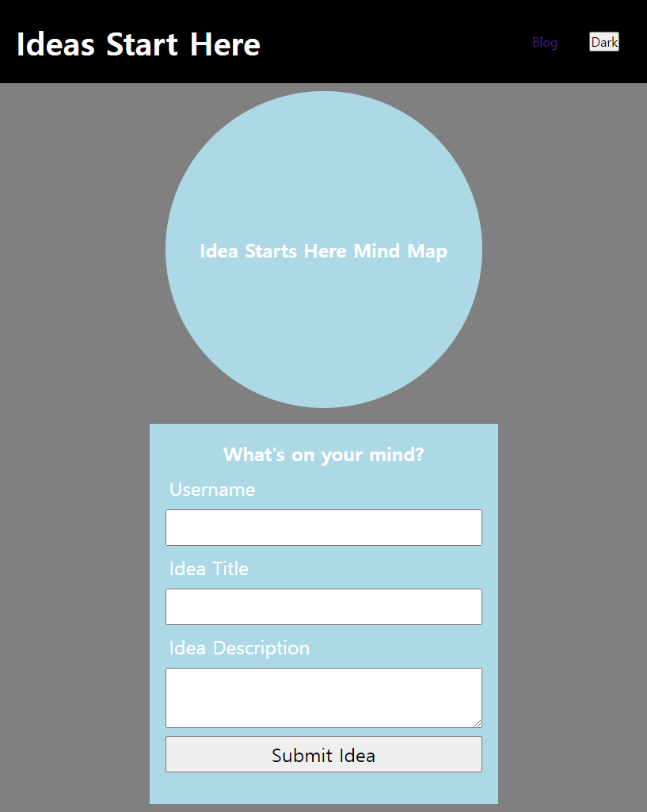

# idea-logs

## Description

A two-page website where users will input and view blog posts. The program will render posts and have light/dark theme toggle.

## Installation

N/A

## Usage

A blog that drack and display uploaded ideas and keeps the information on a separate page.

## Credits

N/A

## Features

None

## Tests

Run the website online and check if there's any spelling errors or bugs\
Page link: https://eliotcho.github.io/idea-logs/

## Screenshots

The following image shows the web application's appearance and functionality:
Main page

Blog page

Phone version

